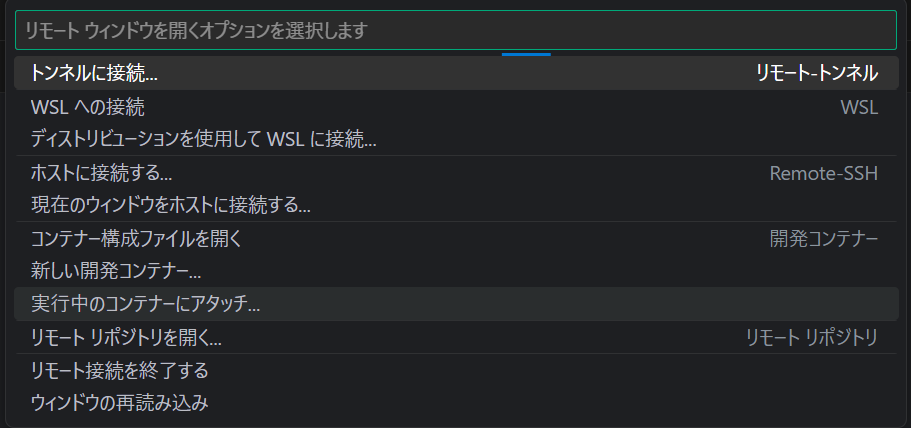
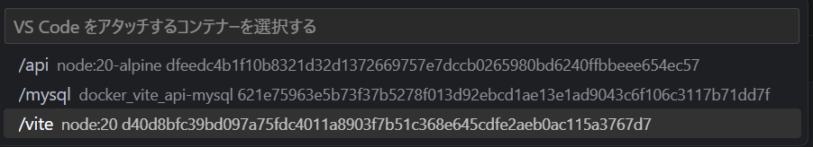
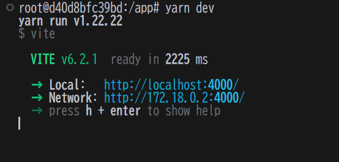
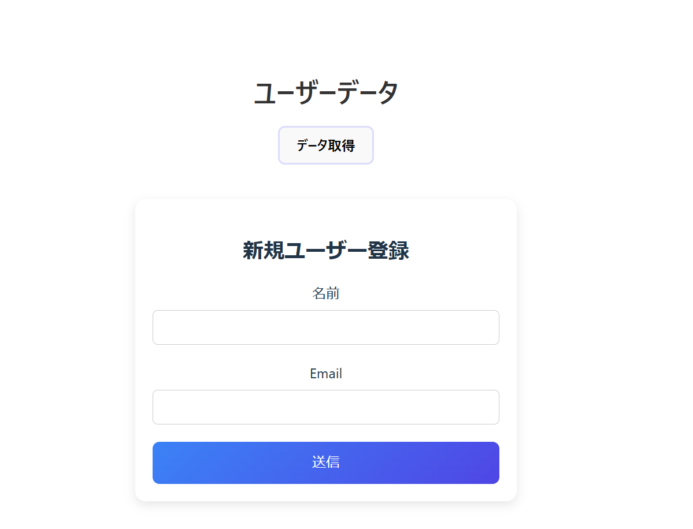

# vite-react-docker

このプロジェクトでは、開発用（`dev`）と本番用（`prod`）の環境を構築します。以下の手順に従って、コンテナを作成・起動してください。

## コンテナのビルド
開発環境（`dev`）と本番環境（`prod`）の両方のコンテナを作成し、イメージをビルドします。

```bash
docker compose --profile dev --profile prod create --build
```

## 開発環境の起動
開発環境（`vite`）を起動します。

```bash
docker compose --profile dev up
```

vscodeの「実行中のコンテナにアタッチ」から「vite」を選択。  
コンテナに入ります。





そのあと、ターミナルにviteの起動コマンドを入力し、開発サーバーを開きます。

```bash
yarn dev
```



最後にこの```http://localhost:4000```にアクセスすればwebページが開きます



## 本番環境の起動
本番環境（`web`）を起動します。

```bash
docker compose --profile prod up
```

その後、```http://localhost:4000```にアクセスすればwebページが開きます。

### ※viteコンテナとwebコンテナは共存不可能なので、片方が既に起動していないことをチェックしてください

## コンテナの停止
すべてのコンテナを停止するには、次のコマンドを実行します。

```bash
docker compose down
```

以上の手順で、開発環境と本番環境を構築し、起動することができます。